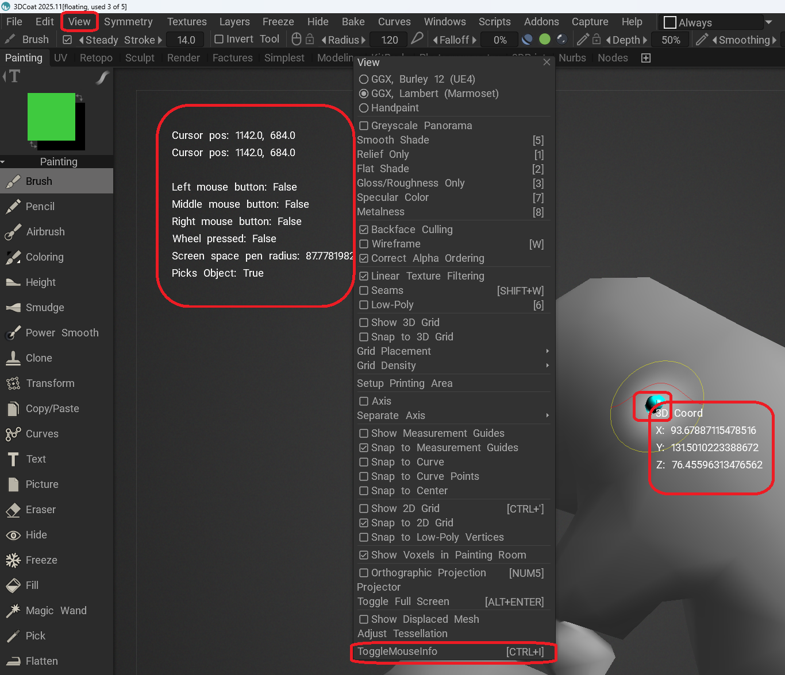
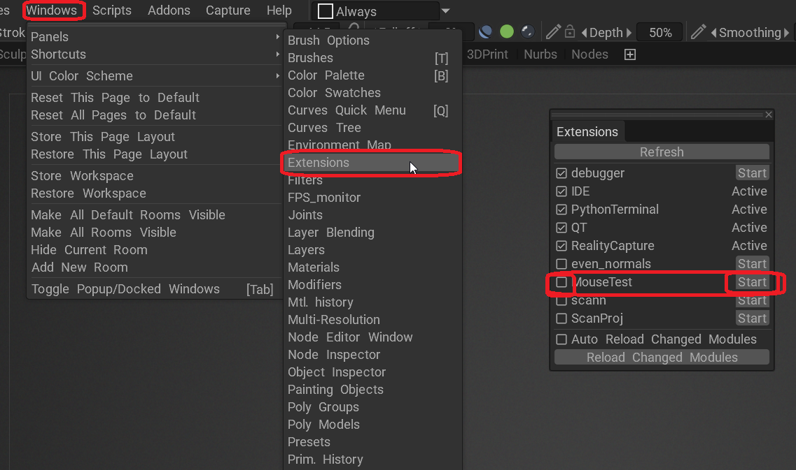
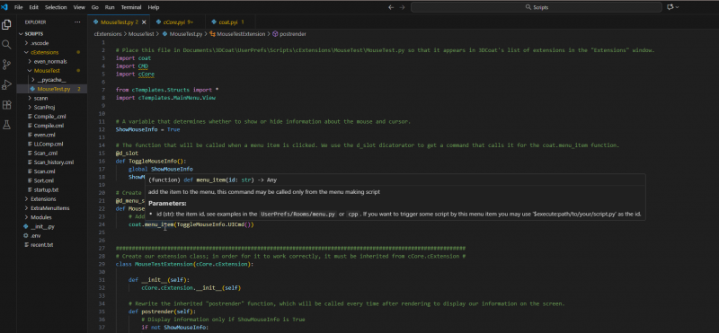

This is an example of an extension that displays information about both the mouse and cursor.
This example shows how to write an extension, how to display information about the mouse and cursor, how to display the information in the viewport, and how to add a menu item with its own function.
(You can assign a hotkey to a menu item you created by hovering your mouse over it and pressing the END button.)

To install the extension in 3DCoat, copy this file to Documents\3DCoat\UserPrefs\Scripts\cExtensions\MouseTest\MouseTest.py . Create any missing folders.
After 3DCoat is loaded, the MouseTest extension will appear in the "Extensions" window. To enable it, click the "Start" button to the right of the extension's name. If you want the extension to start automatically after 3DCoat starts, check the box to the left of the extension's name.

To easily edit extensions, open the Documents\3DCoat\UserPrefs\Scripts folder in Visual Studio Code. Then you can see the documentation in hints, go to modules by holding down the ctrl key and clicking, and to activate the debugger, you just need to press F5 in Visual Studio Code after launching 3DCoat.

